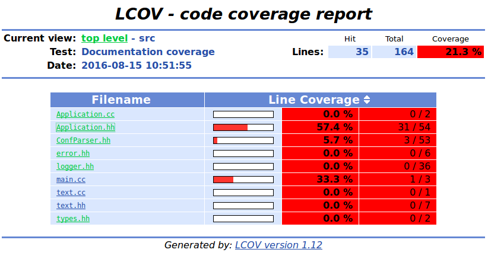
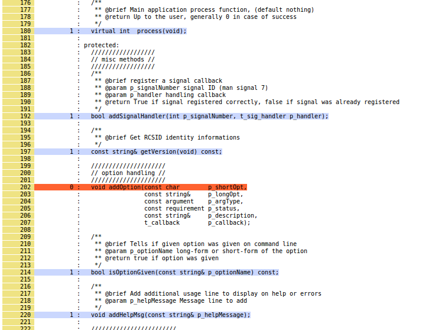

<!-- markdown-toc start - Don't edit this section. Run M-x markdown-toc-generate-toc again -->
**Table of Contents**

- [Coverxygen](#coverxygen)
- [How to](#how-to)
    - [Prerequisites](#prerequisites)
    - [Installation](#installation)
    - [Configure doxygen](#configure-doxygen)
    - [Run Coverxygen](#run-coverxygen)
    - [Run lcov or genhtml](#run-lcov-or-genhtml)
    - [Results](#results)
- [Credits](#credits)
- [Project status](#project-status)

<!-- markdown-toc end -->

# Coverxygen


# How to

First, run doxygen with XML output on your project, Coverxygen will read generated file and produce an lcov compatible output.
Finally, run `lcov` or `genhtml` to produce the coverage output.

Alternatively, Coverxygen can also calculate the coverage and print a summary table when given the option `--format summary`.

## Prerequisites

Coverxygen relies on doxygen to generate the documentation information.
```bash
sudo apt-get install doxygen
```

Additionally, if you want to generate coverage reports using lcov, this needs to be installed as well:
```bash
sudo apt-get install lcov
```

## Installation

From pip

```bash
pip3 install coverxygen
```
From PPA Packages

link : https://launchpad.net/~psycofdj/+archive/ubuntu/coverxygen
```bash
sudo add-apt-repository ppa:psycofdj/coverxygen
sudo apt-get update
# with python2 (default)
sudo apt-get install python-coverxygen
# or with python3
sudo apt-get install python3-coverxygen
```

## Configure doxygen

Tell doxygen to generate an XML version of your doxyfile.cfg configuration
```
GENERATE_XML = YES
```

Then run doxygen
```bash
doxygen <path_to_your_doxygen.cfg>
```

## Run Coverxygen
```bash
python3 -m coverxygen --xml-dir <path_to_doxygen_xml_dir> --src-dir <path_to_root_source_dir> --output doc-coverage.info
```

Full usage :
```
usage: coverxygen [-h] [--version] [--verbose] [--json] [--format FORMAT]
                  [--prefix PREFIX] [--exclude EXCLUDE] [--include INCLUDE]
                  [--scope SCOPE] [--kind KIND] --xml-dir XML_DIR --output
                  OUTPUT --src-dir SRC_DIR

required arguments:
  --xml-dir XML_DIR  path to generated doxygen XML directory
  --output OUTPUT    destination output file (- for stdout)
  --src-dir SRC_DIR  root source directory used to match prefix for relative path generated files

optional arguments:
  -h, --help         show this help message and exit
  --version          print version and exit
  --verbose          enabled verbose output
  --json             (deprecated) same as --format json-legacy
  --format FORMAT    output file format : 
                     lcov         : lcov compatible format (default)
                     json-v3      : json format which includes summary information
                     json-v2      : simpler json format
                     json-v1      : legacy json format
                     json         : (deprecated) same as json-v2
                     json-legacy  : (deprecated) same as json-v1
                     json-summary : summary in json format
                     summary      : textual summary table format
  --prefix PREFIX    keep only file matching given path prefix
  --exclude EXCLUDE  exclude files whose absolute path matches a regular expression;
                     this option can be given multiple times
  --include INCLUDE  include files whose absolute path matches a regular expression
                     even if they also match an exclude filter (see --exclude) or if they
                     are not matching the patch prefix (see --prefix);
                     this option can be given multiple times
  --scope SCOPE      comma-separated list of item scopes to include :
                      - public    : public member and global elements
                      - protected : protected member elements
                      - private   : private member elements
                      - all       : all above
  --kind KIND        comma-separated list of item types to include :
                      - enum      : enum definitions
                      - enumvalue : enum value definitions
                                    Note: a single undocumented enum value will mark
                                    the containing enum as undocumented
                      - friend    : friend declarations
                      - typedef   : type definitions
                      - variable  : variable definitions
                      - function  : function definitions
                      - signal    : Qt signal definitions
                      - slot      : Qt slot definitions
                      - class     : class definitions
                      - struct    : struct definitions
                      - union     : union definitions
                      - define    : define definitions
                      - file      : files
                      - namespace : namespace definitions
                      - page      : documentation pages
                      - all       : all above

```

## Run lcov or genhtml

lcov can be used to generate a simple console output based on documented lines :
```
lcov --summary doc-coverage.info
```

More interesting, produce a html-browsable coverage detail :
```bash
genhtml --no-function-coverage --no-branch-coverage doc-coverage.info -o .
# browse results in index.html
```

## Results

### `summary` Format

```
Classes    :  90.5% (38/42)
Defines    :   0.0% (0/2)
Enum Values:  12.3% (8/65)
Enums      :  75.0% (3/4)
Files      :   8.3% (2/24)
Functions  :  64.8% (175/270)
Namespaces :  75.0% (6/8)
Pages      : 100.0% (7/7)
Signals    :  83.3% (5/6)
Slots      :  28.6% (2/7)
Structs    :  80.0% (4/5)
Typedefs   :  39.1% (9/23)
Variables  :  20.0% (8/40)
-----------------------------------
Total      :  53.1% (267/503)
```

### lcov

Overview



Details



# Credits
Special thanks to Alvaro Lopez Ortega <[alvaro@gnu.org](mailto:alvaro@gnu.org)> who found a smart and efficient solution to retrieve doxygen informations from the generated xml.

You can find his work at [alobbs/doxy-coverage](https://github.com/alobbs/doxy-coverage)

## Hall of Fame

- [j-ulrich](https://github.com/j-ulrich) for his many contributions


# Project status

Unstable but usable.
[](https://badge.fury.io/py/coverxygen)


<!--  LocalWords:  doxyfile cfg xml alobbs doxy -->
<!-- Local Variables: -->
<!-- ispell-local-dictionary: "american" -->
<!-- End: -->
